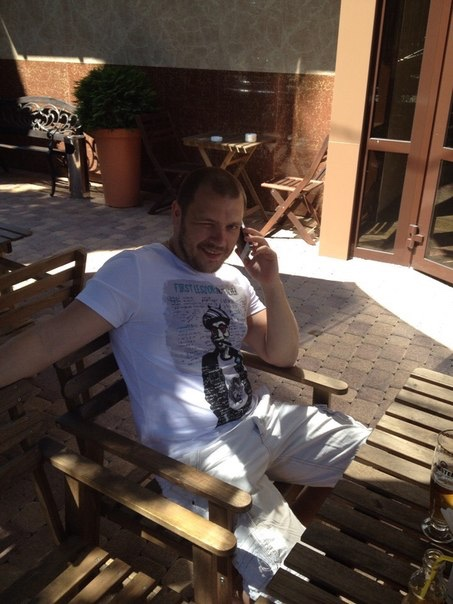

# Михайлов А.Н.

Всем привет!  
 Меня зовут Алексей! Я учусь в Нетологии на курсе Full-Stack разработки.

 ## Немного информации:

### О себе:
 + Мне 38 лет.
 + Работал менеджером проектов в телекоммуникационной компании.
 + Изучаю разработку для себя, хочу создать собственный проект

### О хобби и увлечениях:
- Увлекаюсь игрой на гитаре и музыкой
- Занимаюсь спортом: Велоспорт, единобормтва, тяжелая атлетика и тд.
- Люблю путешествия, новые места, новых друзей.

### И, конечно же, покажу вам, как я выгляжу:
  

